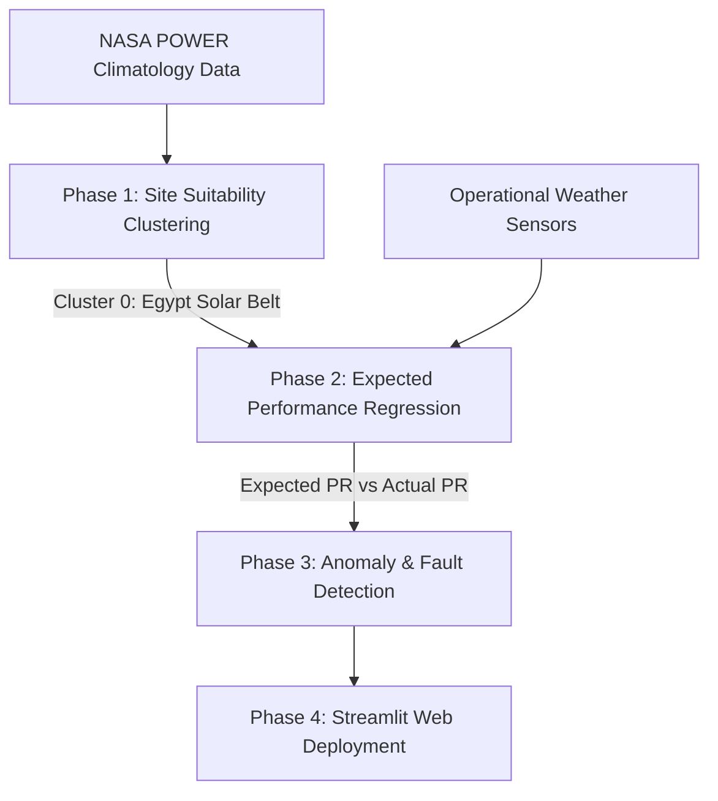

# NTI_Graduation_Project
# SolarPath: Intelligent Solar Analytics, Forecasting & Fault Detection Platform

SolarPath is an end-to-end, data-driven machine learning platform designed to optimize solar energy lifecycle stages: from **geospatial site selection** and **active power forecasting** to **real-time operational fault diagnostics**.

The platform is designed to support Egypt's expanding renewable energy goals (e.g., Benban Solar Park) by identifying optimal solar regions and providing predictive maintenance models for solar PV plants.

---

## 🚀 Project Overview & Architecture

The project is structured into **four operational phases**:

---

## 🌍 Phase 1: Egypt Climatology & Site Suitability (Clustering)
*   **Objective**: Classify 377 geographical grid locations across Egypt to identify the most suitable zones for utility-scale solar PV installations.
*   **Input Data**: NASA POWER annual climatology parameters:
    *   `ALLSKY_SFC_SW_DWN_ANN` (Solar Irradiance)
    *   `RH2M_ANN` (Relative Humidity)
    *   `T2M_ANN` (Air Temperature)
    *   `WS2M_ANN` (Wind Speed)
*   **Data Pipeline & Preprocessing**:
    *   **Outlier Capping**: Handled using IQR bounds (1.5 IQR threshold).
    *   **Yeo-Johnson Transform**: Applied via `PowerTransformer` to correct negative and positive distribution skewness (e.g., reducing solar irradiance skew from `-1.16` to `-0.13` and wind speed from `1.60` to `-0.03`).
    *   **PCA Dimensionality Reduction**: Solved severe multicollinearity (Relative Humidity VIF $>10$), retaining over **98.8% cumulative variance** across 3 principal components.
*   **Models**: Grid-search optimized **K-Means Clustering** ($K=2$) yielding a Silhouette Score of **0.4027**.
*   **Result**: Identified **Cluster 0** (Upper Egypt and Southern Desert) as the optimal solar zone, with an average irradiance of **6.53 kWh/m²/day** and low relative humidity (28.8%).

---

## ⚡ Phase 2: Performance Ratio & Power Forecasting (Regression)
*   **Objective**: Forecast the expected Performance Ratio (PR) and power generation of a PV plant under varying weather conditions.
*   **Input Data**: Combined 34-day operational sensor dataset (136,472 readings) including ambient/module temperatures and irradiance.
*   **Feature Engineering**:
    *   **Grouped Lags & Rolling Features**: 1-hour and 2-hour lags and 3-step rolling means/stds computed *per inverter* (`SOURCE_KEY`) to prevent cross-device data leakage.
    *   **Thermal Delta**: `temp_delta = temp_module - temp_ambient` to represent panel heating.
*   **Models**:
    *   **Prophet Model**: Time-series forecasting model mapping seasonality and daily production curves.
    *   **Target**: `actual_ratio` representing calibrated Performance Ratio (clipped to `[0, 1.2]`).

---

## 🔍 Phase 3: Operational Fault & Anomaly Detection
*   **Objective**: Diagnose underperforming inverters (soiling, shading, string failures, or grid outages) without labeled historical fault data.
*   **Methodology**:
    *   **Deviation Index**: Computes $\text{Deviation} = \text{Actual\_Ratio} - \text{Expected\_Ratio}$.
    *   **Outage Filter**: Extracts absolute outages (when irradiance $>0$ but actual production $=0$) as critical faults.
*   **Models**:
    *   **Isolation Forest**: Unsupervised spatial isolation across a 5D feature space (`Actual_Ratio`, `Expected_Ratio`, `Deviation`, `irradiation`, `temp_delta`).
    *   **Keras Autoencoder**: Deep learning model utilizing reconstruction error (thresholded at the 95th percentile).
*   **Diagnostics**: Identifies critical negative deviation anomalies indicating maintenance triggers (dust accumulation or panel washing cycles).

---

## 💻 Phase 4: Web Application & Deployment (Streamlit)
*   **Objective**: Deploy the trained models into an interactive, user-friendly dashboard for operators.
*   **Implementation**:
    *   A multi-tab Streamlit dashboard (`app.py`) utilizing pre-trained, lightweight pipeline files (`.joblib`).
    *   **Manual Entry Mode**: Input single environmental parameters to get instant site classification, expected power outputs, and fault status.
    *   **Batch CSV Mode**: Upload sequential CSV weather logs to automatically generate time-series predictions, line charts, and download processed anomaly logs.

---
